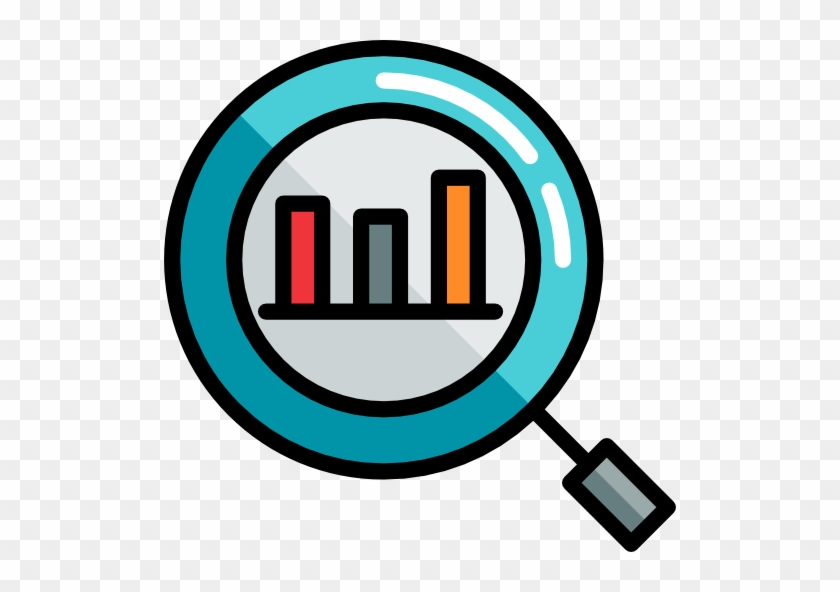

<nobr>

</nobr>

<h1><marquee direction="left">
 "Data Analysis uses data to describe the PAST."   
</marquee></h1>
<h1><marquee direction="right">
 "Data Scientist uses data to describe the FUTURE."   
</marquee></h1>
 
 

<h1>ABOUT ME</h1>

> Hello everyone!I'm a Third-Year Engineering student at [*the Higher School of Statistics and data Analysis*](http://www.essai.rnu.tn/accueil.htm) .Actually, I'm looking for a final internship to complete my training as a future Data Scientist. It's my first web site programming so i hope that you like it!

 

 
<nobr>

</nobr>
 

<h3>THE BRIEF BIO</h3>

 
<ul>
> <li>23 years old</li>
<li>Tunisian student</li>
<li>Data scientist, looking for a final internship</li>
<li>Sport fan, especially Hiking and Fitness</li>
<li>cinéma and photography lover</li>
</ul>

 

<h1>Projects</h1>

 

<article>

<h3><a href="Projects.html">Internship Projects</a></h3>

 <h4>Time series: The monthly evolution of chicken’s production in Tunisia</h4>
<i class="fa fa-calendar"></i> _2018-07_ / _2018-08_

GIPAC, Tunis

<a class="btn btn-outline-primary btn-sm" href="https://salmabouslama.shinyapps.io/timeeseries/" role="button">See shiny</a>

</article>

 

<article>
<h3><a href="Projects.html">Acadamic Projects</a></h3>

<h4>Maps of Tunisia</h4>
<i class="fa fa-calendar"></i> _2018-12_
<a class="btn btn-outline-primary btn-sm" href="https://salmabouslama.shinyapps.io/Tunisia/" role="button">See dashboard</a>

</article>

<a class="btn btn-outline-secondary btn-lg" href="Projects.html" role="button">All Projects</a>

 
 
 

